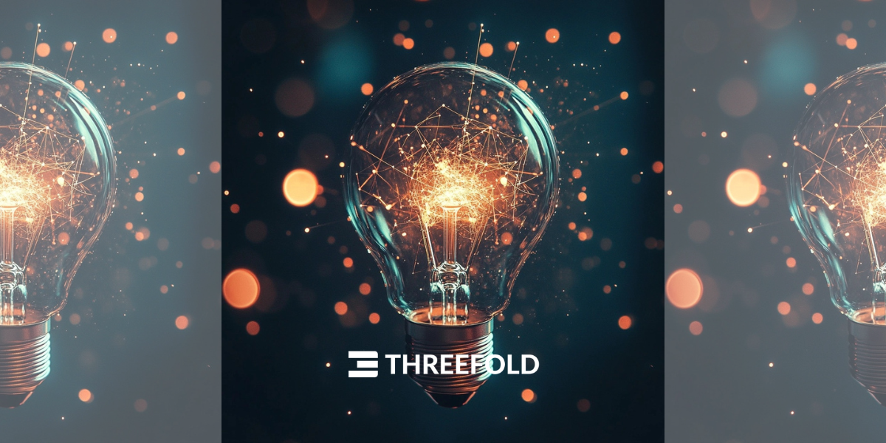

<!-- section 1 (header) -->



## **carousel**



<!-- section 2 (Our Values) -->



<h1 class="value leading-none text-white font-extrabold">Our Values</h1>

|||

- **Integrity,** What we say is what we do.
- **Open Culture,** Respect and accept everyone.
- **Flexibility,** The ability to adapt with the constant and quick changes.
- **Development,** Investing in people is our most rewarding investment.
- **Ownership,** What we promise is what we deliver.
- **Home,** A comfortable and fun environment where you can be yourself.



<!-- section 3 (our services) -->



<h1 class="blue font-bold">Our Services</h1>

 




                          

<h3 class="text-xl font-medium text-white">Managed Services</h3>

Our subcontracting services provide complete IT solutions, covering backend and frontend development management. We ensure smooth operations with proactive monitoring, quick issue resolution, and continuous improvements, so you can focus on your core business goals.
      

|||

<h3 class="text-xl font-medium text-white">Resource Hiring and Assignment</h3>                                                              

We provide tailored offshoring recruitment and staffing solutions, sourcing top talent for backend, frontend, and other technical roles. Our team ensures candidates meet your technical needs and fit your company culture.

      

|||

<h3 class="text-xl font-medium text-gray-700">Delivering customized solutions</h3>

Our outsourcing project management services deliver customized solutions for backend, frontend, and operations projects. We handle planning, resource allocation, and execution to ensure on-time, high-quality results that align with your strategic goals.

      



<!-- section 2 (logos) -->



## **logo**



<!-- section 5 (INCA) -->



|||

#### THE NEXT CHAPTER

## **Ready for commercialization**

For years, ThreeFold has been quietly and steadily developing its innovative technology, with a solid foundation of mature infrastructure that is now ready to take the next leap forward.

 

We are currently fundraising for the next stage of our project – major commercial expansion. This will involve the launch of the $INCA token on the Solana blockchain. If you are interested in learning more or taking part, please reach out.

 

<button class="blue_b">[Get in Touch](https://calendly.com/florian_threefold/30min)</button>



<!-- section 10 (news) -->



## **Top Blogs**





 

##### From the ground up: Three inventions that make ThreeFold possible

|||

 

##### The Evolution of the Internet: From free to controlled, and back again

|||

<h3 class="mt-0 font-semibold">JOIN IN</h3>

 

 <a href="https://manual.grid.tf" target="_blank">
    <h4 class="text-xl green_text font-normal my-0">Manuals</h4>
    
Dive deeper into our technology

    </a>
    

     

     <a href="https://threefoldfaq.crisp.help/en/" target="_blank">
    <h4 class="text-xl green_text font-normal my-0">Support</h4>
    
Get assistance from our Support Team

    </a>
    

      

      <a href="/community" target="_blank">
    <h4 class="text-xl green_text font-normal my-0">Community</h4>
    
Be part of our journey and participate

    </a>
    



